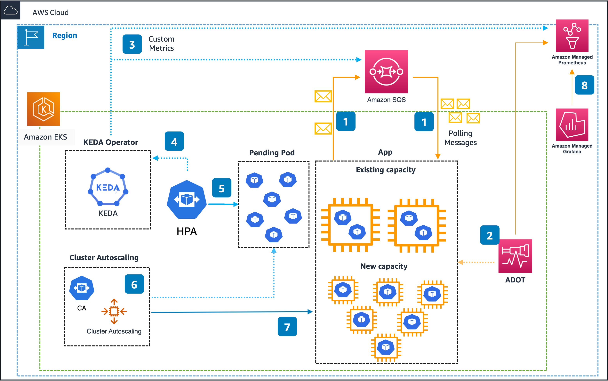

## About the Guidance

In this [Guidance](#put-link-here), we will dive deep into the concepts of KEDA with examples. As part of this exercise, we will also learn how using KEDA can lower compute cost scaling Kubernetes Pods based on events like the amount of messages in [Amazon SQS](https://aws.amazon.com/sqs/) Queue or customized metrics from [Amazon Managed Service for Prometheus](https://aws.amazon.com/prometheus/).

## About KEDA

[KEDA](https://keda.sh/) is a single-purpose and lightweight component that can be added into any Kubernetes cluster. KEDA works alongside standard Kubernetes components like the [Horizontal Pod Autoscaler](https://kubernetes.io/docs/tasks/run-application/horizontal-pod-autoscale/) and can extend functionality without overwriting or duplication. Currently, KEDA has over 60 scalers available to detect if a deployment should be activated or deactivated, and feed custom metrics for a specific event source. 

Current default Kubernetes scaling mechanism based on CPU and memory utilization are not efficient enough for event-driven applications. Those mechanisms lead to over or under provisioned resources that might generate a poor cost efficiency or customer experience. KEDA enables scaling based on custom metrics. For example, business metrics like the amount of orders or payments waiting to be processed, or technical metrics, like the number of concurrent requests or response time.


## Understanding the project structure

1. Starting with ```/keda``` folder, where it's compose by files regarding Keda, such as Keda operator policy and values.


2. In the ```/scaledobject-samples``` folder, it's composed by files regarding the **ScaledObject**, containing the following subfolders:

    2.1. In the ```/amazonsqs``` folder are the files referring to the application that will consume the messages from Amazon SQS queue together with its **ScaledObject**.

    2.2. In the ```/prometheus``` folder are the files related to the application configurations that will consume custom metrics from [Amazon Prometheus](https://aws.amazon.com/prometheus/) together with its **ScaledObject**.

3. And in the ```/setup``` folder are the files related to the Amazon EKS cluster setup.


## Architecture



## Main services that make up the guidance.

- [Amazon Elastic Kubernetes Services (EKS)](https://aws.amazon.com/eks/)
- [Amazon SQS](https://aws.amazon.com/sqs/)
- [Amazon Managed Service for Prometheus](https://aws.amazon.com/prometheus/)
- [AWS Distro for OpenTelemetry (ADOT)](https://aws-otel.github.io/)
- [Amazon Managed Grafana](https://aws.amazon.com/grafana/)


## Security

See [CONTRIBUTING](CONTRIBUTING.md#security-issue-notifications) for more information.

## License

This library is licensed under the MIT-0 License. See the LICENSE file.