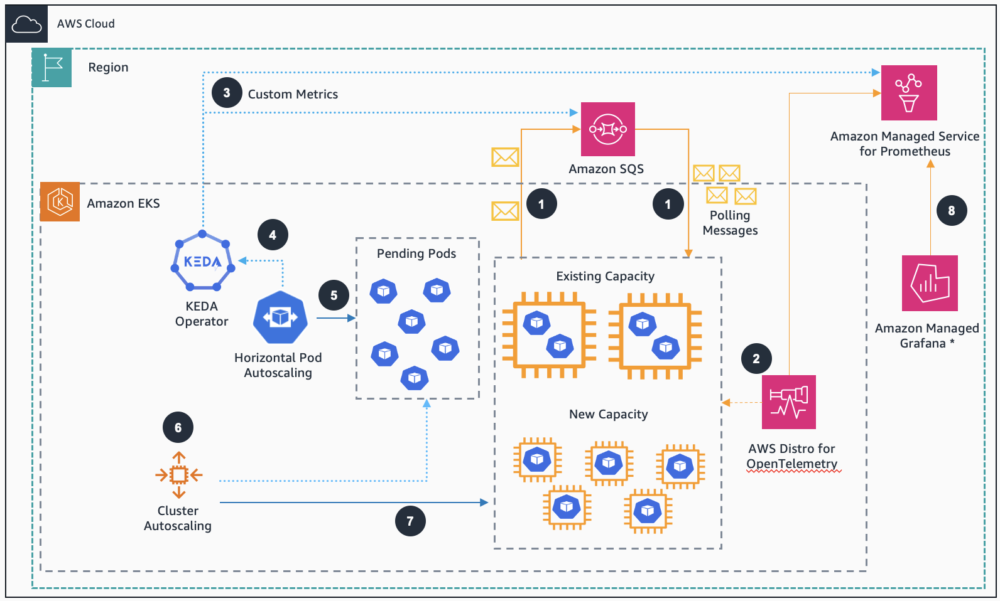

# Guidance for Event Driven Application Autoscaling with KEDA on Amazon EKS

This repository consists code for `Guidance for Event Driven Application Autoscaling with KEDA on Amazon EKS`.

#### Table of Contents

* [Overview](#overview)
* [About KEDA](#about-keda)
* [Cost](#cost)
* [Architecture](#architecture)
* [Prerequisites](#prerequisites)
* [Security](#security)
* [Cleanup](#cleanup)
* [License](#license)


## Overview

In this [Guidance](#put-link-here), we will dive deep into the concepts of KEDA with examples. As part of this exercise, we will also learn how using KEDA can lower compute cost scaling Kubernetes Pods based on events like the amount of messages in [Amazon SQS](https://aws.amazon.com/sqs/) Queue or customized metrics from [Amazon Managed Service for Prometheus](https://aws.amazon.com/prometheus/).

## About KEDA

[KEDA](https://keda.sh/) is a single-purpose and lightweight component that can be added into any Kubernetes cluster. KEDA works alongside standard Kubernetes components like the [Horizontal Pod Autoscaler](https://kubernetes.io/docs/tasks/run-application/horizontal-pod-autoscale/) and can extend functionality without overwriting or duplication. Currently, KEDA has over 60 scalers available to detect if a deployment should be activated or deactivated, and feed custom metrics for a specific event source. 

Current default Kubernetes scaling mechanism based on CPU and memory utilization are not efficient enough for event-driven applications. Those mechanisms lead to over or under provisioned resources that might generate a poor cost efficiency or customer experience. KEDA enables scaling based on custom metrics. For example, business metrics like the amount of orders or payments waiting to be processed, or technical metrics, like the number of concurrent requests or response time.

### Cost 

You are responsible for the cost of the AWS services used while running
this Guidance. As of April 2024, the cost for running this
Guidance with the default settings in the US West (Oregon) is approximately **\$ 302.24
a month**.

Refer to the pricing webpage for each AWS service used in this Guidance.

We recommend creating
a [budget](https://alpha-docs-aws.amazon.com/awsaccountbilling/latest/aboutv2/budgets-create.html) through [AWS
Cost
Explorer](http://aws.amazon.com/aws-cost-management/aws-cost-explorer/) to
help manage costs. Prices are subject to change. For full details, refer
to the pricing webpage for each AWS service used in this Guidance.

### Cost table

The following table provides a sample cost breakdown for deploying this
Guidance with the default parameters in the US West (Oregon) Region
for one month.

| **AWS service**  | Dimensions | Cost \[USD\] |
|-----------|------------|----------|
| Amazon Elastic Kubernetes Service | 1 managed control plane | \$ 0.10 per Hour |
| Amazon Elastic Compute Service | 2 or 3 m5.large instances | \$ 0.096 per instance per Hour |
| Amazon Elastic Container Registry | less than 1GB of storage | \$ 0.10 per GB per month |
| Amazon Simple Queue Message | less than 1 million requests | \$ 0.40 per Million |
| Amazon Managed Service for Prometheus | less than 10M samples ingested + less than 1GB Storage | \$ 0.90 per 10M samples + \$ 0.03 per GB per Month | 
| Amazon Cloud9 | 1 t2.micro Linux instance | \$ 0.0116 per hour + \$ 0.10 per GB per month of provisioned storage |
| Amazon Managed Grafana | Optinally 1 Editor license | \$ 9 per user per month |


## Architecture


Figure 1: KEDA architecture on AWS

### Architecture steps
1. App using Amazon SQS to decouple communication between microservices.
2. AWS Distro for OpenTelemetry (ADOT) gets metrics from application and sends to Amazon Managed Prometheus (AMP).
3. KEDA configured to use Amazon SQS and Prometheus scaler to get SQS queue length and Prometheus custom metrics.
4. KEDA (keda-operator-metrics-apiserver) exposes event data for HPA to scale.
5. Horizontal Pod Autoscaling (HPA) scales the number of pods.
6. Cluster Autoscaling (CA) provisions the required nodes using auto scaling group (works with Karpenter as well)
7. New Capacity provisioned as required.
8. Amazon Managed Grafana (AMG) **optionally** configured to show metrics from AMP in a dashboard.


## Understanding the project structure

1. Starting with ```/keda``` folder, where it's compose by files regarding Keda, such as Keda operator policy and values.


2. In the ```/scaledobject-samples``` folder, it's composed by files regarding the **ScaledObject**, containing the following subfolders:

    2.1. In the ```/amazonsqs``` folder are the files referring to the application that will consume the messages from Amazon SQS queue together with its **ScaledObject**.

    2.2. In the ```/prometheus``` folder are the files related to the application configurations that will consume custom metrics from [Amazon Prometheus](https://aws.amazon.com/prometheus/) together with its **ScaledObject**.

3. In the ```/setup``` folder are the files related to setup the environment and Amazon EKS cluster.


## Prerequisites

- Set up [AWS Cloud9](https://aws.amazon.com/cloud9/) Environment.
  
To deploy the Cloud9 instance and the IAM role instance profile, you can run the ``` /setup/cloud9-instance-enviroment.yaml ``` CloudFormation template.

> [!NOTE]  
> The IAM role instance profile and the IAM policy attached will be created automatically, you only need to attach the IAM role instance profile named ``` eks-keda-guidance-cloud9admin ```  at the Cloud9 instance after creation.

- Clone this Github repository to the Cloud9 environment you have created.
- Execute the setup script: ``` chmod +x setup/*.sh ./setup/tools.sh```

The ```tools.sh``` script in AWS Cloud9 terminal will install the following tools and configure them:

- eksctl
- kubectl
- awscli
- Helm CLI
- jq, envsubst (from GNU gettext utilities) and bash-completion
- Install k9s a Kubernetes CLI to Manage Your Clusters in Style
- Enable kubectl bash_completion
- Verify the binaries are in the path and executable
- Enable some kubernetes aliases
- Configure aws cli with your current region as default.
- Save these into bash_profile

#### Create EKS Cluster
- Execute the following scripts to setup environment variables and deploy Amazon EKS cluster:

``` 
./setup/env.sh

source /home/ec2-user/.bashrc 

eksctl create cluster -f setup/cluster.yaml 
```

#### Create the IAM OIDC Identity Provider
- Create the IAM OIDC Identity Provider for the cluster:

```  eksctl utils associate-iam-oidc-provider --cluster $CLUSTER_NAME --approve ```

```echo "export OIDC_ID=$(aws eks describe-cluster --name $CLUSTER_NAME --query 'cluster.identity.oidc.issuer' --output text | cut -d '/' -f 5)" >> /home/ec2-user/.bashrc && source /home/ec2-user/.bashrc``` 

#### Test access to EKS cluster
- ```kubectl get nodes```


## Deployment steps and Validation

To continue implementing the Guidance click  **[Implementation Guide](https://gitlab.aws.dev/wwso-guidance-samples/implementation-guides/guidance-for-event-driven-application-autoscaling-with-keda-on-amazon-eks/-/blob/main/ed_kedaeks_IG.md?ref_type=heads#cleanup-sqs-environment)** to learn more.


## Main services that make up the guidance.

- [Amazon Elastic Kubernetes Services (EKS)](https://aws.amazon.com/eks/)
- [Amazon SQS](https://aws.amazon.com/sqs/)
- [Amazon Managed Service for Prometheus](https://aws.amazon.com/prometheus/)
- [AWS Distro for OpenTelemetry (ADOT)](https://aws-otel.github.io/)
- [Amazon Managed Grafana](https://aws.amazon.com/grafana/) (optional)


## Security

See [CONTRIBUTING](CONTRIBUTING.md#security-issue-notifications) for more information.

## Cleanup

Please follow the steps in [Clean up Section of the Implementation Guide](https://gitlab.aws.dev/wwso-guidance-samples/implementation-guides/guidance-for-event-driven-application-autoscaling-with-keda-on-amazon-eks/-/blob/main/ed_kedaeks_IG.md?ref_type=heads#cleanup-sqs-environment)

## License

This library is licensed under the MIT-0 License. See the LICENSE file.
